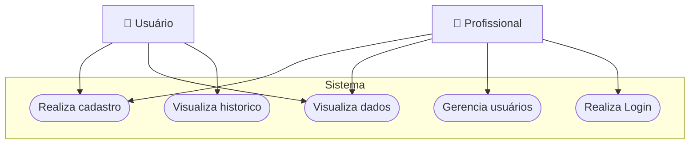

```mermaid
flowchart TD
    actor1["👤 Usuário"]
    actor2["👤 Profissional"]

    subgraph Sistema

        uc1([Realiza cadastro])
        uc2([Visualiza dados])
        uc3([Gerencia usuários])
        uc4([Realiza Login])
        uc5([Visualiza historico])
 
    end

    actor1 --> uc1
    actor1 --> uc2
    actor1 --> uc5
    actor2 --> uc1
    actor2 --> uc2
    actor2 --> uc3
    actor2 --> uc4
```